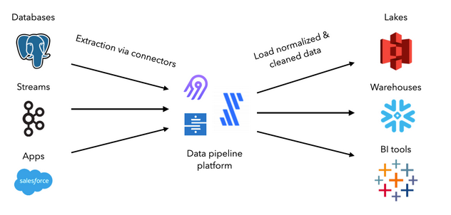
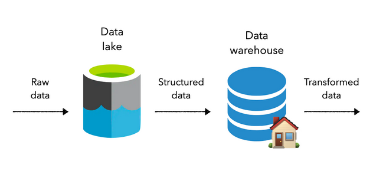
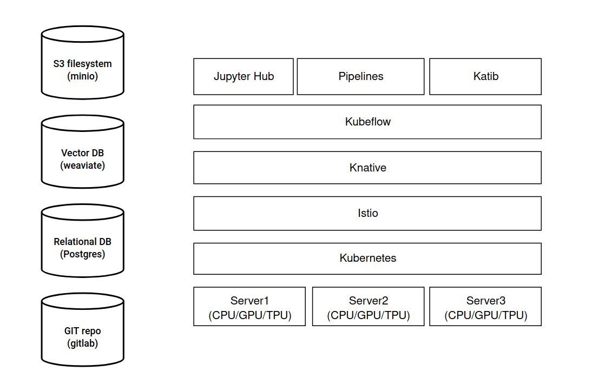
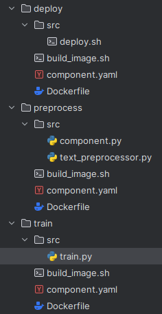
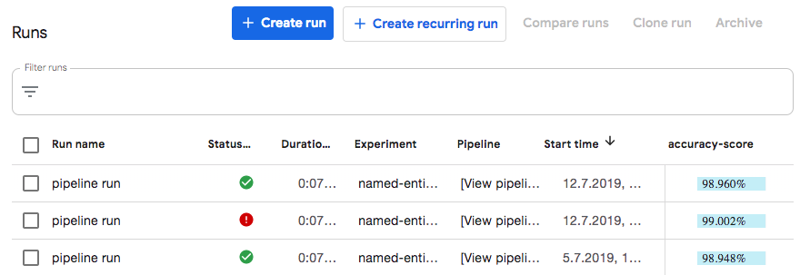
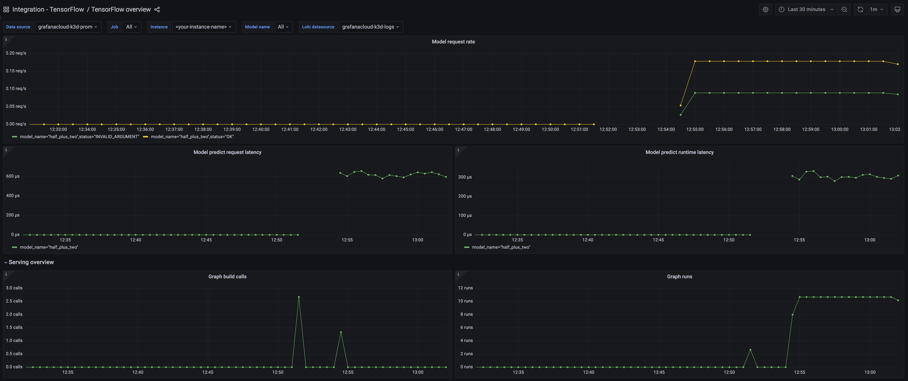
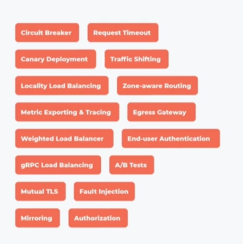
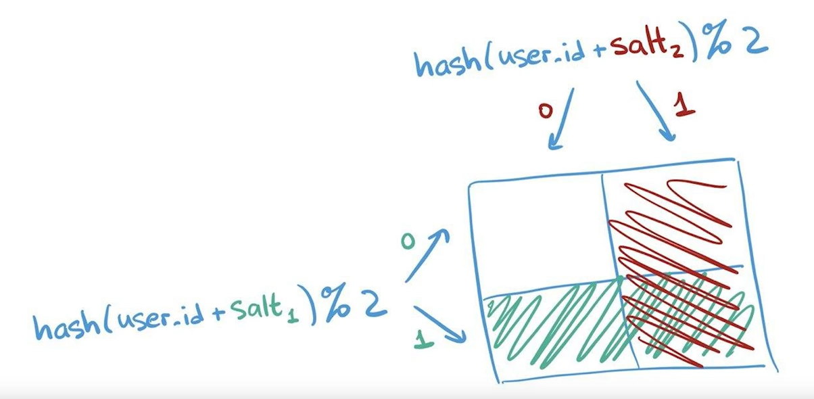
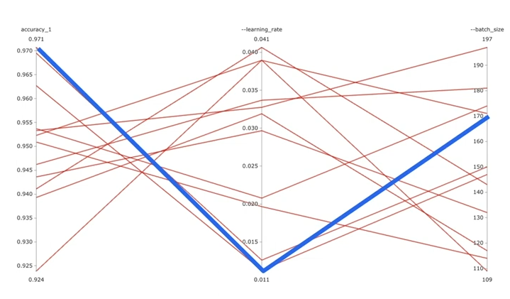

## Описание проекта:
Компания разрабатывает систему голосового бота для обслуживания клиентов. Система использует несколько моделей машинного обучения, включая модели распознавания речи (STT), понимания естественного языка (NLU), генерации ответов и преобразования текста в речь (TTS). Ваша задача - спроектировать и описать MLOPS-процессы для эффективного управления жизненным циклом этих моделей.


## Задачи:
### 1) Архитектура MLOps:
*Разработайте высокоуровневую архитектуру MLOps для данного проекта.*

### Ответ:
Сперва нам понадобится подход для сбора данных из разных источников и раскидывания их в соответствующие базы 
* Data lake для неструктурированных и сырых
* Database для тех данных которые можно представить в реляционной или нереляционной форме (графовые, key-value итд)
* Data warehouse для данных с которыми удобнее работать в колоночном а не столбцовом виде (OLAP)

Для этого можно использовать к примеру airbyte



Хорошей практикой считается хранение сырых данных в Data lake и по мере необходимости обрабатывать их и переводить в соответствующие потребностям аналитиков хранилища, содержащие необходимые операции над ними.



Чаще всего преобразования данных включают в себя определение схем, фильтрацию, очистку и объединение данных в таблицы или иные формы пригодные для аналитики. 
В современном мире одного SQL (сохранять запросы как таблицы или представления) не хватает поэтому используют dbt, который предоставляет производственные функции для управления версиями, тестирования, документирования, упаковки и т.д. 
Это становится критически важным для поддержания наблюдаемости и высококачественных рабочих процессов данных.

Далее, нам понадобится инфраструктура для того чтобы ML инженер обладал инструментами для быстрой и эффективно непосредственной работы со всеми этими данными, построением версионированных моделей и экспериментами над ними. Для этого можно использовать следующий подход:


Сервера для вычислений объединяется в единый кластер с помощью Kubernetes. В качестве инструмента контейнеризации может быть дефолтный Docker.
Для service mash популярен Istio в связке с Knative. Затем разворачиваем service Kubeflow который позволяет создавать поды для экземпляров Jupyter, а также поды для создания пайплайнов и подбора гиперпараметров.
В качестве хранилищ артефактов между этапами пайплайнов можно использовать minio.
Также полезно хранить токены в виде векторов в векторной базе данных, а общую аналитическую информацию по токенам в реляционной базе. Также в реляционной базе можно хранить предобработанные обучающие и тестовые наборы для моделей.
Для хранения кодовой базы понадобится git репозиторий и docker хранилище для сгенерированных образов докера

### 2) Непрерывная интеграция и доставка (CI/CD)
*Предложите стратегию CI/CD для моделей машинного обучения.*
*Опишите процесс автоматизации тестирования, оценки и развертывания моделей.*

### Ответ
Каждый этап пайплайна машинного обучения, например preprocess -> train -> deploy, билдится отдельно в отдельный контейнер со своей версией.
Для билда по коммиту можно использовать инструмент actions гитхаба или аналогичный для гитлаба
Соответственно для каждый этап будет находиться в собственной папке и будет содержать:
1) Dockerfile и скрипт (например build_image.sh) для билда
2) Настроечный файл (например component.yaml) для настройки компонента, который понадобится для привязки этого этапа в kubeflow pipeline
3) Папку (например src) для хранения логики исполняющейся на каждом этапе

4) 

После создания этапов нам понадобится Jupyter notebook для создания пайплайна, и подготовки экспериментов непосредственно в вебморде kubeflow
После каждого проведения эксперимента в kubeflow, его результаты можно отправлять в s3 в определенные бакеты и создать скрипт который будет в автоматическом режиме читать эти результаты и производить оценку 

### 3) Управление данными
*Разработайте стратегию управления данными для обучения и оценки моделей. Предложите подход к версионированию данных и обеспечению их качества*

### Ответ:
Для работы с данными имеет смысл использовать [dbt-core](https://github.com/dbt-labs/dbt-core) он позволяет создавать модели для работы с данными в том числе версионирование и проводить тестирование для проверки качества данных.  

### 4) Мониторинг и логирование
*Опишите систему мониторинга производительности моделей в реальном времени. Предложите набор метрик для отслеживания и пороговые значения для оповещений*

### Ответ:
К примеру можно собирать метрики точности предсказания модели (accuracy) во время этапа train с помощью callbacks которые tensorflow отправляет сам в момент обучения (параметр callbacks метода model.fit) в виде json для tensorboard и использовать для отображения прямо в вебморде kubeflow или в самом tensorboard



Также можно настроить вывод информации из callbacks в несколько мест, в том числе и в виде метрик для prometheus и затем отображать их в дашборде grafana
Набор популярных метрик для prometheus которые поставляются tensorflow коробки.
* :tensorflow:core:graph_build_calls
* :tensorflow:core:graph_build_time_usecs
* :tensorflow:core:graph_run_time_usecs
* :tensorflow:core:graph_runs
* :tensorflow:serving:batching_session:queuing_latency_count
* :tensorflow:serving:batching_session:queuing_latency_sum
* :tensorflow:serving:request_count
* :tensorflow:serving:request_latency_count
* :tensorflow:serving:request_latency_sum
* :tensorflow:serving:runtime_latency_count
* :tensorflow:serving:runtime_latency_sum

Пример как это может выглядеть в графане


Оповещение может происходить в случае если точность ниже критически важного порога для бизнеса, или если модель обрабатывает запросы слишком медленно.
* TensorFlowModelRequestHighErrorRate
* TensorFlowServingHighBatchQueuingLatency

### 5) Масштабирование
*Разработайте стратегию масштабирования инфраструктуры для обработки растущего объема запросов. Предложите подход к балансировке нагрузки между различными сервисами и версиями*

### Ответ:
Масштабирование инфраструктуры производится путем горизонтального скалирования доступных nodes в кластере kubernetes и размещения на этих nodes дополнительных pods в replicaSet через настройку deployments и подключения этих deployments и nodes в соотвтетсвующие внешние services.
Для аккуратного введения новых версий модели в эксплуатацию можно использовать istio, к примеру, добавляя новую версию модели в прод постепенно в рамках той или иной фокус группы пользователей (canary deployment).

Полный набор сетевых паттернов которые могут быть реализованы с помощью istio:



### 6) Управление версиями моделей
*Разработайте стратегию версионирования моделей и артефактов. Опишите процесс отката к предыдущим версиям в случае проблем.*

### Ответ:
Для того чтобы работать с версионированными моделями и артефактами в kubeflow можно использовать механизм custom prediction routine.
Для каждой версии этапа preprocess или train можно сохранить в s3 bucket артефакт содержащий пригодные для обучения данные или обученные модели которые затем переиспользовать при проведении экспериментов.
Для отката к предыдущей версии достаточно выбрать из s3 bucket нужную версию, использовать ее для сформирования соответствующего pipepline и затем использовать этот pipeline при формировании эксперимента  

### 7) A/B тестирование
*Предложите механизм проведения A/B тестов для оценки новых версий моделей. Опишите как будут приниматься решения о полном развертывании новых моделей*

### Ответ:
Предположим что аллокация любого пользователя в наши эксперименты не влияет на поведени другого пользователя.
Тогда сперва необходимо разделить пользователей наших моделей на контрольную и тестовую группы независимо от поведения пользователей. Один из способов получить такие независимые разбиения это хешировать идентификаторы пользователей и получить отстаток от деления на 2. 
Т.е если получили 1 то пользователь в тестовой группе если 0 то в контрольной группе. Свойство детерминированности такого псевдорандомного числа позволяет нам на каждый заход пользователя давать одну и ту же группу.
Помимо этого нам понадобится соль под каждый независимый эксперимент запущенный для этого пользователя. Таким образом мы получим максмиально независимые разбиения пользователей.


Далее мы для каждой группы в рамках каждого эксперимента сформируем свою версию модели и подберем набор метрик по которым мы будем оценивать поведение пользователя и заносить эти метрики в базу данных для последующего статистического анализа. 
Каждая группа пользователей будет работать со своей версией модели спомощью canary deployment, который поможет реализовать service mash, например istio.
Версии модели которые после статистического анализа полученных экспериментов показали наилучшие результаты будут затем полностью развертываться.

### 8) Автоматическое обучение и настройка
*Разработайте систему для автоматического переобучения моделей на новых данных. Предложите подход к автоматической настройке гиперпараметров.*

### Ответ:
Для автоматической настройки гиперпараметров можно использовать Katib. Он разворачивается в качестве одного из сервисов kubeflow и работает следующим образом.
Например мы хотим оптимизировать 2 гиперпараметра, learning rate и batch size для увеличения accuracy.
Для этого нам понадобится написать конфигурационный yaml файл где основными параметрами будут
1) spec:
* maxTrialCount - общее количество проводимых katib экспериментов c различными гиперпараметрами
* parallelTrialCount - количество проводимых katib экспериментов одновременно, соответственно под каждый параллельный эксперимент понадобятся ресурсы и как минимум 1 pod
* maxFailedTrialCount - количество неудачных экспериментов после которых katib прекратит работу

2) objective:
* type - цель метрики к которой katib будет стремиться, например maximize для нахождение максимальной accuracy
* goal - значение цели при котором katib остановится, например 0.99
* objectiveMetricName - наимерование этой метрики для формирования результатов, например accuracy_1

3) algorithm
* algorithmName - алгоритм который katib будет использовать для настройки значений гиперпараметров, например random, tpe, medianstop

4) parameters - содержим список параметров которые мы будем подбирать
```yaml
parameters:
  - name: --learning_rate
    parameterType: double
    feasibleSpace:
      min: "0.01"
      max: "0.05"
  - name: --batch_size
    parameterType: int
    feasibleSpace:
      min: "100"
      max: "200"
```
По окончанию работы katib в вемборде можно получить такой график и оценить при каких параметрах --learning_rate и --batch_size удалось получить максимальный accuracy_1


### 9) Безопасность и соблюдение требований
*Опишите меры по обеспечению безопасности моделей и данных. Предложите подход к аудиту и соблюдению нормативных требований (например GDPR)*
### Ответ:
Затрудняюсь ответить, не успел разобраться


### Практическое задание
*Реализуйте систему версионирования для моделей машинного обучения и связанных с ними артефактов*

### Ответ:
В папке practice содержатся папки
* components - содержащая сборку этапов препроцессинга текста (preprocess) и описания + обучения модели (train) 
* routine - содержит код для выполнения этапов препроцессинга (text_preprocessor) и предсказания (model_prediction) используя данные полученных из артефактов которые ренее были сохранены в s3 бакет, фактически не выполняя дорогостоющие операции этих этапов а используя версии артефактов из бакета

Для запуска скриптов необходимо прописать енвы с именем бакета и названием проекта в google storage

```bash
export BUCKET=test-bucket-v0.01
export PROJECT_ID=test-project-v0.01
```

Также необходимо создать бакет
```bash
gsutil mb -c regional -l eu-west1 gs://${BUCKET}
```

который затем использовать для сохранения предоботанных данных и модели например в google storage

```python
gsutil cp processor_state.pkl gs://${BUCKET}/artifacts/processor_state.pkl
gsutil cp keras_saved_model.h5 gs://${BUCKET}/artifacts/keras_saved_model.h5
```

P.S. Подход очень наколеночный и за основу деплоя компонет взят один из официальны примеров kubeflow, так чтобы было красиво, надо имплементировать всю работу с пайплайнами kubeflow и задействовать его механизмы для удобного использования версий в пайплайнах.

P.P.S. В компонентах осталось много конфигурационных енвов которые нужны были для работы kubeflow pipelines, так что код не будет работать но суть он передает достаточно понятно и если нужно мы можем созвониться и я пройдусь по всему коду того примера и расскажу про каждый элемент и функцию.
